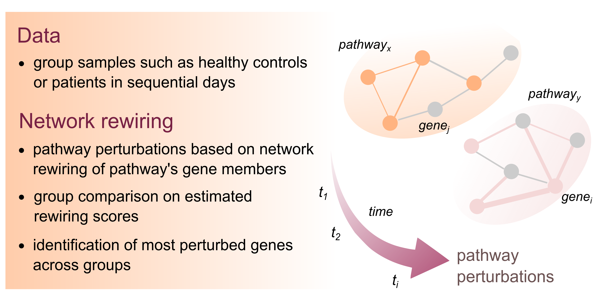

# NetworkRewiring

R package for quantiying pathway perturbations in gene co-expression networks between two timepoints. 



## Features

- Preprocessing gene co-expression data.
- Compute gene co-expression networks defined as pathway specific biological processes obtained from KEGG and GO databases.
- Compute network rewiring scores and generate pathway specific summary statistics (as a pathway perturbation proxy).

## Installation

```r
# install.packages("devtools")
devtools::install_github("kiakoudimi/NetworkRewiring")
```

## Quick start

Pipeline overview:

1. Prepare a gene expression data matrix (e.g. normalize, log2-transform)
2. Construct an object describing the data, group and time points.
3. Call `run_analysis()` to estimate gene co-expression networks, gene rewiring, and pathway-specific statistical summaries over their gene rewiring members.


```r
library(NetworkRewiring)
net <- new("gene_network",
            gene_intensities = gi,
            group_name       = 'Healthy',
            timepoints       = c(1,2),
            metadata         = ids,
            output_dir       = 'results',
            dataset          = 'Dataset_name',
            database         = 'KEGG',
            pathways         = pathways,
            group_col        = "Group",
            subjects_ids     = "id",
            sample_ids       = "ID",
            time_col         = "Day",
            time_labels      = c('Day1', 'Day2'))

run_analysis(net)
```

## Examples folder

The `examples/scripts/` folder includes three scripts as:

| Script | Usage |
|---|---|
| `run_example.R` | Code for reproducing the pipeline on the datasets GSE54514, GSE48080, and GSE95233. Their data are in `examples/data/` folder.
| `run_template.R` | Template code for running the pipeline on different datasets.
| `run_example_visualization.R` | Code for reproducing figures and visualize results on the example datasets.

### Data requirements

- **`gene_intensities`** - a numeric matrix with gene as rows and sample IDs as columns
- **`metadata`** - a data.frame with one row per sample that includes a group columns (e.g. 'Group'), a time point column (e.g. 'Day'), a subject column (e.g. 'id'), and a sample ID column (e.g. 'ID').
- **`pathways`** - a data.frame of pathways or biological processes (see examples for KEGG and GO in folder `data/`).

### Output 

Estimated edge lists, rewiring scores and statistical summaries will be exported in:
​

```<output_dir>/<dataset>/<database>/<group_name><timepoint1><timepoint2>​```

inlcuding the folders edge_lists, dynet_score, and an .RData file with statistical summary. 

## License

CC BY-NC 4.0 License
